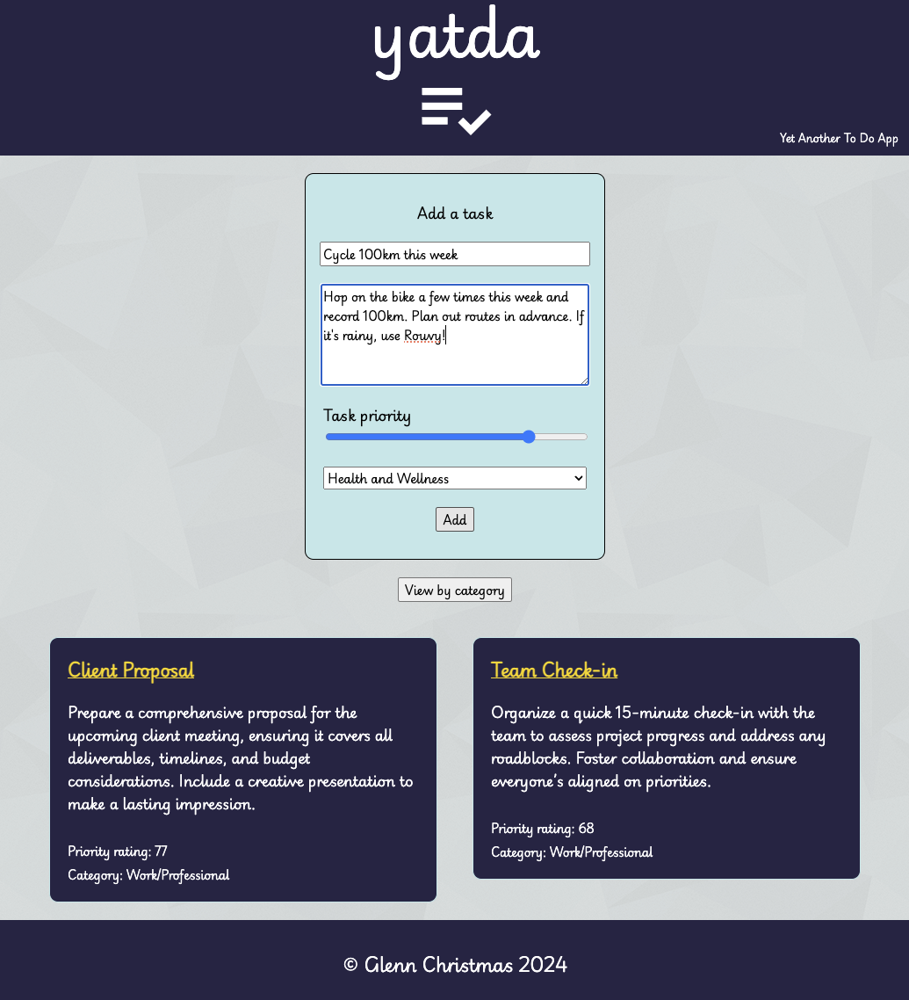
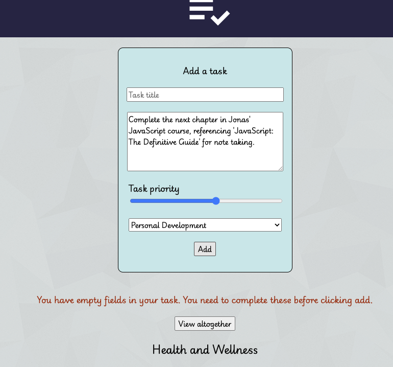
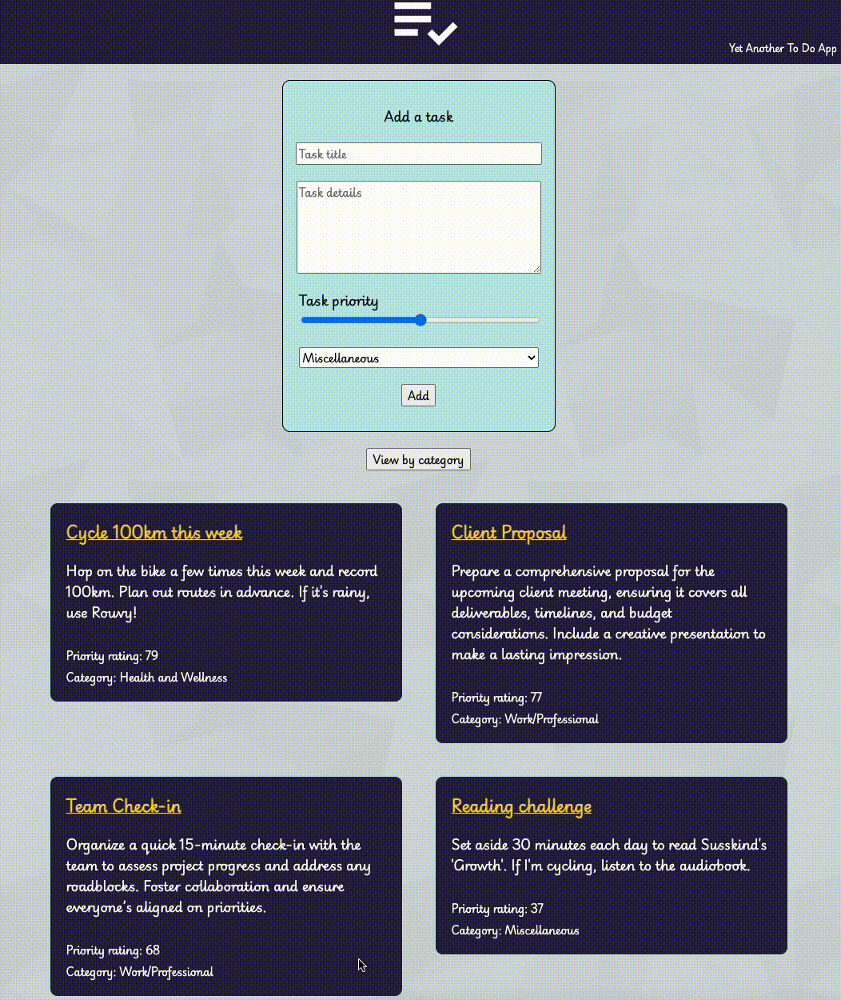

# Welcome to yatda

I built this app to recap my understanding of React after completing Angela Yu's introduction to React in her [full stack web dev course](https://www.udemy.com/course/the-complete-web-development-bootcamp/). This app is very basic, in both a literal and a proverbial sense. However, I thought it was a bit of a right of passage to make a to do app as a first step along my front end journey!

## Installation

To install this, feel free to fork or clone this repo. After that, you'll need to check your working directory is correct (e.g. by using `pwd` on the command line). Then install the dependencies with `npm install`.

Once the dependencies are installed, use `npm start` and have fun recording your to dos!

## Functionality

### Order by priority

Tasks are ordered from left to right in descending manner. This allows users (well, at least those from cultures who read left-to-right) to quickly identify higher vs lower priority tasks.

### Basic input validation

Very rudimentary input validation to prevent missing responses for task title or task description is included.

### Category view

Users can select to view all of their to do items together (e.g. if they wish to quickly see the highest priority task) or display them by category.

## Future plans

The app currently lacks item deletion. I may add this in future as manipulating the arrays that contain the to do items will probably be a useful refresher of array methods, particularly when I have split these into several arrays for the category view.
